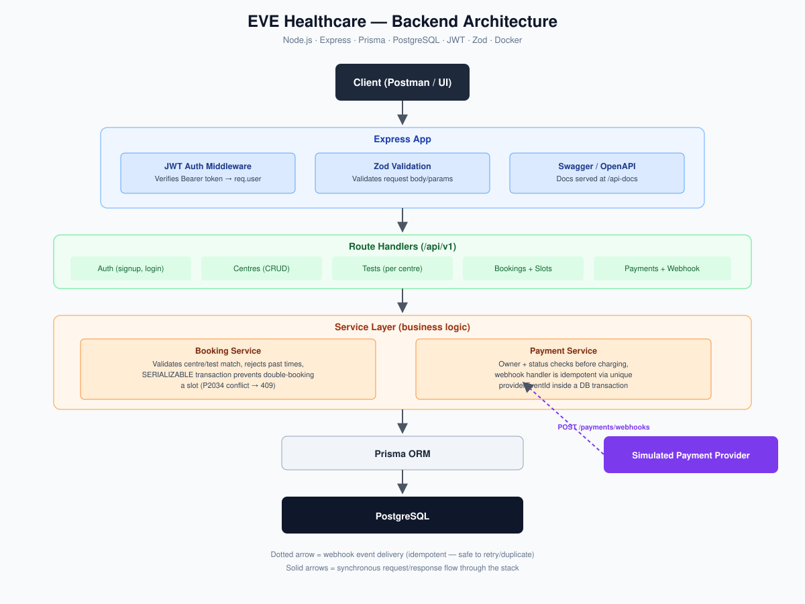

# EVE Healthcare — Diagnostic Test Booking & Payments API

A backend service for browsing diagnostic centres and tests, booking appointments, and processing (simulated) payments — built for the EVE Healthcare SDE Intern assignment.

**Stack:** Node.js · Express · Prisma · PostgreSQL · JWT · Zod · Docker · Jest + Supertest

---

## Assumptions

- **No role-based access control** — there's a single `User` role; no separate `admin` concept. Centre/test management endpoints are only gated by "must be authenticated," not by an admin role.
- **A test belongs to exactly one centre** — tests aren't shared across centres; each `Test` row has a single `centreId`.
- **A "slot" is defined purely by appointment time**, not by test — the availability check keys off `(centreId, testId, appointmentTime)`, so two different tests at the same centre can be booked in overlapping time windows if they're logically independent services (this only matters if a centre reasonably runs both at once).
- **Payment amount is derived from the booking**, not passed in the payment request — `POST /payments` doesn't accept an `amount`; it always charges `booking.amount`, which itself is snapshotted from `test.price` at booking time (so a later test price change doesn't affect existing bookings).
- **The webhook endpoint is unauthenticated** — in a real system this would be protected by a provider signature header (e.g. HMAC), which was out of scope for the simulated provider here.

---

## Architecture



Requests flow through JWT auth middleware and Zod validation, into route handlers, into a service layer that holds all business rules, and down to PostgreSQL via Prisma. The payment webhook is the one asynchronous entry point — it's built to be safely retried without corrupting booking state.

---

## Key design decisions

**Slot locking (no double-booking).**
Booking creation runs inside a Prisma transaction with `isolationLevel: "Serializable"`. Two concurrent requests for the same centre + test + appointment time will have one succeed and one fail with a `409` — Postgres's serialization-conflict error (`P2034`) is caught and converted into a clean `409 Conflict` rather than a `500`.

**Slot availability.**
Available slots are generated in fixed 30-minute increments between 9 AM–6 PM for a given centre/test/date, then filtered against any `PENDING` or `CONFIRMED` booking for that exact slot. `CANCELLED` and `FAILED` bookings free the slot back up automatically.

**Payment idempotency (webhook safety).**
The webhook handler checks for an existing payment by `providerEventId` (a unique column) *before* doing anything else. If the event was already processed, it short-circuits and returns the existing record instead of reprocessing. As a second safeguard, it also checks that the payment is still `PENDING` before mutating it — so even a re-delivered event for a payment that's already resolved is a safe no-op. Both checks run inside a single transaction alongside the related booking-status update, so payment and booking state can never drift apart.

**Authorization.**
Bookings and payments are owner-scoped: a user can only view, cancel, or pay for their own booking (`403` otherwise).

---

## Database schema

| Model | Key fields | Notes |
|---|---|---|
| `User` | `id`, `name`, `email` (unique), `password` | Has many `Booking` |
| `Centre` | `id`, `name`, `location` | Unique on `(name, location)`; has many `Test`, `Booking` |
| `Test` | `id`, `name`, `price`, `centreId` | Belongs to exactly one `Centre` |
| `Booking` | `id`, `userId`, `testId`, `centreId`, `appointmentTime`, `amount`, `status` | `status`: `PENDING \| CONFIRMED \| FAILED \| CANCELLED` |
| `Payment` | `id`, `bookingId`, `status`, `providerEventId` (unique, nullable) | `status`: `PENDING \| SUCCESS \| FAILED`; `providerEventId` uniqueness is what makes the webhook idempotent |

Full schema: [`prisma/schema.prisma`](./prisma/schema.prisma)

---

## API Endpoints

All endpoints are prefixed with `/api/v1`. Endpoints marked 🔒 require `Authorization: Bearer <token>`.

### Auth
| Method | Path | Description |
|---|---|---|
| POST | `/auth/signup` | Register a new user |
| POST | `/auth/login` | Log in, returns a JWT |

```http
POST /api/v1/auth/signup
Content-Type: application/json

{
  "name": "Asha Rao",
  "email": "asha@example.com",
  "password": "SecurePass123"
}
```

```http
POST /api/v1/auth/login
Content-Type: application/json

{
  "email": "asha@example.com",
  "password": "SecurePass123"
}
```
Response: `{ "token": "<jwt>" }`

### Centres 🔒
| Method | Path | Description |
|---|---|---|
| POST | `/centres` | Create a centre |
| GET | `/centres` | List all centres |
| GET | `/centres/:id` | Get a centre by id |
| PATCH | `/centres/:id` | Update a centre |
| DELETE | `/centres/:id` | Delete a centre |

### Tests 🔒
| Method | Path | Description |
|---|---|---|
| POST | `/centres/:centreId/tests` | Add a test to a centre |
| GET | `/centres/:centreId/tests` | List tests for a centre |
| GET | `/tests/:id` | Get a test by id |
| PATCH | `/tests/:id` | Update a test |
| DELETE | `/tests/:id` | Delete a test |

### Bookings 🔒
| Method | Path | Description |
|---|---|---|
| POST | `/bookings` | Create a booking |
| GET | `/bookings` | List the current user's bookings |
| GET | `/bookings/available-slots` | Get free slots for a centre/test/date |
| GET | `/bookings/:id` | Get a booking (owner only) |
| PATCH | `/bookings/:id/cancel` | Cancel a booking (owner only) |

```http
POST /api/v1/bookings
Authorization: Bearer <token>
Content-Type: application/json

{
  "testId": "5b1c...",
  "centreId": "8a2f...",
  "appointmentTime": "2026-10-05T10:30:00.000Z"
}
```

```http
GET /api/v1/bookings/available-slots?centreId=8a2f...&testId=5b1c...&date=2026-10-05
```

### Payments
| Method | Path | Description |
|---|---|---|
| POST | `/payments` 🔒 | Initiate a (simulated) payment for a booking |
| POST | `/payments/webhooks` | Provider webhook — idempotent, no auth (provider-signed in production) |

```http
POST /api/v1/payments
Authorization: Bearer <token>
Content-Type: application/json

{
  "bookingId": "9c4d..."
}
```

```http
POST /api/v1/payments/webhooks
Content-Type: application/json

{
  "eventId": "evt_a1b2c3",
  "paymentId": "9c4d...",
  "status": "SUCCESS"
}
```

Full request/response schemas are documented interactively via Swagger at:
```
GET /api-docs
```

---

## Running locally

### Option A — Docker (recommended)

```bash
docker-compose up --build
```

This starts Postgres and the API together. The API will be available at `http://localhost:5000`, and Swagger docs at `http://localhost:5000/api-docs`.

> The committed `docker-compose.yml` uses placeholder credentials (`eve_user` / `REDACTED`) and a placeholder `JWT_SECRET` for local convenience only — replace these before any real deployment.

### Option B — Local Node + Postgres

```bash
npm install

cp .env.example .env
# fill in DATABASE_URL and JWT_SECRET

npx prisma migrate deploy
npx prisma generate

npm run dev
```

### Environment variables

| Variable | Description |
|---|---|
| `DATABASE_URL` | Postgres connection string |
| `JWT_SECRET` | Secret used to sign/verify JWTs |
| `PORT` | Port the API listens on (default `5000`) |

---

## Testing

Tests are written with **Jest** and **Supertest**, run against a real (test) Postgres database rather than mocks — this matters especially for the booking-conflict and webhook-idempotency logic, which depend on actual database transaction behavior.

```bash
npm test
```

Coverage includes:
- Auth: signup/login validation, JWT rejection on invalid/missing tokens
- Bookings: creation, ownership checks (403 on other users' bookings), cancellation state guards, concurrent double-booking of the same slot (expects one `201` and one `409`)
- Payments: owner-only payment initiation, blocking a second payment on an already-paid booking
- Webhook: idempotent replay of the same event (no duplicate payment/booking mutation), rejection of events for unknown payments

---

## What I'd improve with more time

- Add signature verification on the webhook endpoint to simulate a real payment provider's security model.
- Add role-based access control (`admin` vs `user`) so centre/test management isn't open to any authenticated user.
- Add rate limiting on `/payments` and `/payments/webhooks` to guard against abuse/retry storms.
- Add structured logging (e.g. `pino`) with request IDs, especially around the payment/webhook flow, to make production debugging easier.
- Add pagination to `GET /centres` and `GET /bookings` for larger datasets.
- Move slot configuration (opening hour, closing hour, slot duration) into per-centre configuration instead of global constants, since real diagnostic centres would have different operating hours.
